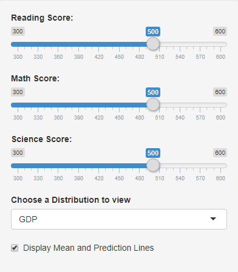
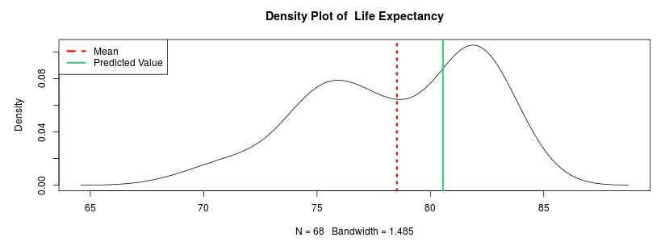

# World-Development-and-Education-Correlations

Running instance available at https://rabex028.shinyapps.io/educationcorrelations/

## Welcome

The purpose of this application is to allow users to interactively explore associations between reading, science, and math scores and how they correspond to various indicators of development within a country. Users can adjust education scores for a hypothetical country and predictions will be made about that country's GDP, labor force participation, military expenditure, and other metrics of development. Predictions are made by using multiple regression models that rely mostly on gamma distributions. If you would like more information on the regression models, please view the Diagnostics tab located at the top of the app's screen.

## About the Data

The data used for this project is compiled from 68 Countries from the year 2015. It was gathered from two seperate datasets that are managed by an organization called The World Bank, which is dedicated to eliminating poverty at a global level. The first dataset is named World Development Indicators, which features data from 217 countries that was collected by surveys done by the partners of The World Bank, such as the National Science Foundation, the United Nations, the International Energy Agency, and many more. In addition, some of the data has been provided upon request by governments themselves. The other dataset is called Education-Statistics: Learning-Outcomes, which contain Program for International Student Assessment (PISA) scores from participating countries. PISA scores assess proficiency in the areas of math, science, and reading in a standardized way for students at the age of 15. The scores in the dataset are numeric and fluctate between 300 and 600, with higher values indicating more proficiency.

These datasets were paired and trimmed to include only data from the year 2015, and only country development information for GDP, homicide rates, labor force participation, life expectancy, military expenditure, number of infant deaths, exposure to air pollution, nondiscriminatory hiring based on gender, undernourishment prevalence, female labor force proportion, and suicide incidence. Each of these development factors are also numeric within the dataset, although the values can represent categorical, percentage, and continuous count information. There are some missing entries for these indicators which will be discussed in the next section.

## How to Use this Application

You can switch to a different section of the app by clicking on the tabs at the top of the page. User predictions can be made within the predictions tab. The desired scores can be chosen by moving the sliders located on the left-hand side of the predictions page.

Predictions will be updated on the right side of the page based on the new combination of scores. On the bottom of the page, a density plot displays the distribution of actual values for a particular indicator that was observed from the 68 countries. The density plot can be changed to show information for any indicator by selecting the desired indicator from the drop-down menu on the left side of the page. In addition, lines can be shown on the plot that indicate where the mean and new predicted value would appear in the actual distribution. This option can be disabled by checking the box on the left side of the page. Note that the predicted value line may not appear on the plot if its value is greater or less than what is observed in the actual distribution.

The number of missing values for an indicator can be determined by looking at the bottom of the density plot. When the plot displays 'N=68' for an indicator, it has no missing values. When this number is below 68, the number of missing values is the difference between 68 and the shown number. Information about the models used for multiple regression can be viewed by clicking on the diagnostic tab. Two plots are shown for each model, and the model can be changed from the drop down menu on the left side of the diagnostics page. The first plot displays the residuals vs fitted data, and the second shows a normal Quantile-Quantile plot.

## Disclaimer About Predictions

Please note that the primary purpose for this app is to explore associations between variables, there is no guarantee that the predictions that are generated by the application will be accurate. In fact, the predictions can sometimes be absurd, and therefore all results should be viewed with a healthy amount of skepticism. Far-fetched results are more likely to be seen when unlikely combinations of scores are used to make predictions. So as a general rule, more reasonable education scores with smaller distances between the three values provided to the app will produce more credible predictions.
